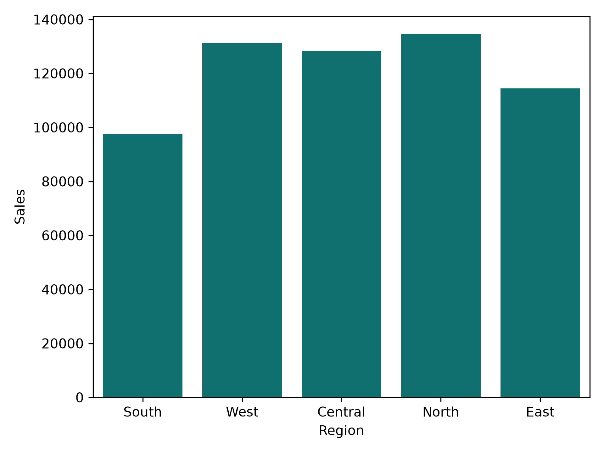

# 📊 Sales Data Analyzer

**Author:** Prit Baldha\
**Project Type:** Python Data Analysis Project\
**Language:** Python\
**Notebook:** `main(20260810-120703).ipynb`

------------------------------------------------------------------------

## 📌 Project Overview

**Sales Data Analyzer** is a Python-based data analysis project designed
to provide a simple, menu-driven way to load, explore, manipulate,
clean, and analyze sales data stored in a CSV file.

The project is implemented using an object-oriented approach through a
custom `SalesDataAnalyzer` class. Instead of writing every operation
separately, the project groups related functionality inside a reusable
class.

The project demonstrates practical use of:

-   Python
-   Pandas
-   NumPy
-   Matplotlib
-   Seaborn
-   Object-Oriented Programming
-   CSV data handling
-   DataFrame operations
-   Data cleaning
-   Descriptive statistics
-   Data visualization concepts

The project is suitable for beginners who are learning Python for **Data
Science, Data Analytics, and Machine Learning**.

------------------------------------------------------------------------

## 🎯 Project Objectives

The main objectives of this project are:

1.  Load a sales dataset from a CSV file.
2.  Explore the structure and contents of the dataset.
3.  Display the first and last records.
4.  Display column names and data types.
5.  Perform NumPy array operations on numeric columns.
6.  Perform mathematical operations on numeric data.
7.  Combine DataFrames using Pandas.
8.  Filter sales records by region.
9.  Calculate basic aggregate statistics.
10. Detect missing values.
11. Fill missing numeric values using the mean.
12. Remove rows containing missing values.
13. Replace missing values with a user-defined value.
14. Provide a foundation for descriptive statistics and visualization.
15. Present sales information through charts such as sales by region.

------------------------------------------------------------------------

## 🛠️ Technologies and Libraries

### Python

Python is used as the main programming language because it provides a
simple syntax and a large ecosystem for data analysis.

### Pandas

Pandas is used for:

-   Reading CSV files
-   Creating and manipulating DataFrames
-   Filtering records
-   Checking missing values
-   Calculating statistics
-   Combining DataFrames
-   Working with columns and rows

Example:

``` python
self.data = pd.read_csv(file_path)
```

### NumPy

NumPy is used for numerical operations and converting Pandas columns
into NumPy arrays.

Example:

``` python
arr = self.data[column].to_numpy()
```

The project demonstrates operations such as:

``` python
arr + 10
arr - 10
arr * 2
arr / 2
```

### Matplotlib

Matplotlib is imported for creating data visualizations such as bar
charts and other graphical representations.

### Seaborn

Seaborn is imported as a visualization library and can be used to create
attractive statistical charts.

------------------------------------------------------------------------

## 📂 Project Structure

A suggested project structure is:

``` text
Sales-Data-Analyzer/
│
├── main(20260810-120703).ipynb
├── README.md
├── Bar-chart.png
└── dataset.csv
```

### Files

  -----------------------------------------------------------------------
  File                                Description
  ----------------------------------- -----------------------------------
  `main(20260810-120703).ipynb`       Main Jupyter Notebook containing
                                      the Python implementation

  `README.md`                         Project documentation

  `Bar-chart.png`                     Sales by region bar chart

  `dataset.csv`                       Input sales dataset used by the
                                      analyzer
  -----------------------------------------------------------------------

The exact CSV filename can be different because the notebook asks the
user to enter the dataset path at runtime.

------------------------------------------------------------------------

# 🧠 Main Class

The core of the project is the:

``` python
class SalesDataAnalyzer:
```

This class stores the sales dataset and provides functions for different
analysis tasks.

------------------------------------------------------------------------

## 1. Constructor

The constructor initializes the object:

``` python
def __init__(self):
    self.data = pd.DataFrame()
    self.plot = None
```

### Purpose

-   `self.data` stores the loaded sales dataset.
-   `self.plot` is reserved for storing a generated plot.

Initially, `self.data` is an empty DataFrame.

------------------------------------------------------------------------

# 📥 2. Loading the Dataset

The `load_data()` method asks the user for the location of a CSV file.

``` python
file_path = input("Enter the path of the dataset (CSV file) : ")
```

The dataset is loaded using:

``` python
self.data = pd.read_csv(file_path)
```

If the file does not exist, the program handles the error:

``` python
except FileNotFoundError:
    print("\n❌ File not found. Please try again.")
```

### Example

``` text
Enter the path of the dataset (CSV file) : sales.csv
```

If the file is available, the program displays:

``` text
✅ Dataset loaded successfully!
```

------------------------------------------------------------------------

# 🔍 3. Exploring the Data

The `explore_data()` method provides several options for understanding
the dataset.

The available options are:

``` text
1. Display first 5 rows
2. Display last 5 rows
3. Display column names
4. Display data type
5. Display basic info
```

### First 5 Rows

The following command displays the first five records:

``` python
self.data.head()
```

### Last 5 Rows

The last five records can be displayed using:

``` python
self.data.tail()
```

### Column Names

The project displays all column names using:

``` python
list(self.data.columns)
```

### Data Types

Data types are displayed using:

``` python
self.data.dtypes
```

### Basic Information

The project also provides:

``` python
self.data.info()
```

This can show information such as:

-   Number of records
-   Number of columns
-   Column names
-   Non-null counts
-   Data types

------------------------------------------------------------------------

# 🔢 4. DataFrame Operations

The `dataframe_operations()` method provides several operations.

The menu contains:

``` text
1. NumPy Array Operations
2. Mathematical Operations
3. Combine DataFrames
4. Split Data
5. Aggregating Functions
```

------------------------------------------------------------------------

## 4.1 NumPy Array Operations

A numeric DataFrame column is converted into a NumPy array:

``` python
arr = self.data[column].to_numpy()
```

The project then displays:

-   The complete array
-   First element
-   Last element

Example:

``` python
arr[0]
arr[-1]
```

This demonstrates how Pandas and NumPy can work together.

------------------------------------------------------------------------

## 4.2 Mathematical Operations

The project performs basic mathematical operations on a numeric column.

### Addition

``` python
arr + 10
```

### Subtraction

``` python
arr - 10
```

### Multiplication

``` python
arr * 2
```

### Division

``` python
arr / 2
```

These operations demonstrate NumPy's vectorized calculations.

------------------------------------------------------------------------

# 🔗 5. Combining DataFrames

The project demonstrates DataFrame concatenation using:

``` python
df2 = self.data.head(2)
result = pd.concat([self.data, df2])
```

This combines the original DataFrame with the first two rows.

This section demonstrates the basic concept of combining DataFrames
using Pandas.

------------------------------------------------------------------------

# 🌍 6. Filtering Data by Region

The project allows the user to enter a region and filter the dataset.

The filtering operation is:

``` python
region = input("Enter region : ")
result = self.data[self.data["Region"] == region]
```

For example:

``` text
Enter region : North
```

The program returns records where the `Region` column is equal to
`North`.

This is useful for analyzing sales for a particular geographical region.

------------------------------------------------------------------------

# 📈 7. Aggregating Sales Data

The project provides basic aggregate functions for a selected numeric
column.

The available calculations are:

-   Sum
-   Mean
-   Count
-   Minimum
-   Maximum

### Sum

``` python
self.data[column].sum()
```

The sum represents the total value of the selected numeric column.

### Mean

``` python
self.data[column].mean()
```

The mean represents the average value.

### Count

``` python
self.data[column].count()
```

The count represents the number of non-null values.

### Minimum

``` python
self.data[column].min()
```

The minimum returns the smallest value.

### Maximum

``` python
self.data[column].max()
```

The maximum returns the largest value.

------------------------------------------------------------------------

# 🧹 8. Handling Missing Data

Data cleaning is an important part of data analysis.

The `clean_data()` method provides four options:

``` text
1. Display rows with missing values
2. Fill missing value with mean
3. Drop rows with missing values
4. Replace missing value with a specific value
```

------------------------------------------------------------------------

## 8.1 Detect Missing Values

The project checks whether missing values exist using:

``` python
self.data.isnull().values.any()
```

If missing values are found, rows containing missing values are
displayed.

``` python
self.data[self.data.isnull().any(axis=1)]
```

------------------------------------------------------------------------

## 8.2 Fill Missing Numeric Values With Mean

The project identifies numeric columns:

``` python
numeric_cols = self.data.select_dtypes(include=np.number).columns
```

Missing numeric values can then be replaced with the mean:

``` python
self.data[numeric_cols] = self.data[numeric_cols].fillna(
    self.data[numeric_cols].mean()
)
```

This is useful when numeric missing values should be retained rather
than deleting the complete record.

------------------------------------------------------------------------

## 8.3 Drop Rows With Missing Values

The project can remove rows containing missing values:

``` python
self.data.dropna(inplace=True)
```

This permanently changes the DataFrame stored in `self.data` during the
current program execution.

------------------------------------------------------------------------

## 8.4 Replace Missing Values

The project also allows the user to enter a replacement value:

``` python
val = input("Enter the value to replace missing values : ")
self.data.fillna(val, inplace=True)
```

This provides a simple manual approach to missing-value handling.

------------------------------------------------------------------------

# 📊 9. Sales Visualization

A sales-by-region bar chart is included with the project.

The chart compares sales across five regions:

-   South
-   West
-   Central
-   North
-   East

The chart uses:

-   **X-axis:** Region
-   **Y-axis:** Sales

The displayed chart shows that **North has the highest sales among the
five regions**, while **South has the lowest sales** in the shown
visualization.

The approximate values visible in the chart are:

  Region      Approx. Sales
  --------- ---------------
  South              97,500
  West              131,000
  Central           128,000
  North             134,000
  East              114,000

> These values are approximate readings from the provided chart and are
> included only to describe the visualization. The notebook code shown
> in the project does not contain the underlying chart-generation code
> or the original sales dataset.



------------------------------------------------------------------------

# 📌 Visualization Interpretation

The bar chart makes it easy to compare regional sales performance.

### North

North has the tallest bar and therefore represents the highest sales
value in the displayed chart.

### West

West is the second-highest region based on the displayed sales values.

### Central

Central has sales slightly below West but still represents a
strong-performing region.

### East

East has a moderate sales value and is below North, West, and Central.

### South

South has the shortest bar and therefore has the lowest sales among the
displayed regions.

### Overall Observation

The chart indicates that sales are not equally distributed among
regions. The North region performs the strongest, while South performs
the weakest.

------------------------------------------------------------------------

# 🖥️ Menu-Driven Program

The notebook creates an analyzer object:

``` python
obj = SalesDataAnalyzer()
```

The program then displays a main menu:

``` text
Welcome to Sales Data Analyzer!

Main Menu

1. Load Dataset
2. Explore Data
3. Perform DataFrame Operations
4. Handle Missing Data
5. Generate Descriptive Statistics
6. Data Visualization
7. Save Visualization
8. Exit
```

The program continues running inside a `while True` loop until the user
selects option `8`.

------------------------------------------------------------------------

# 🔄 Program Workflow

The general workflow is:

``` text
Start
  ↓
Create SalesDataAnalyzer Object
  ↓
Load CSV Dataset
  ↓
Explore Dataset
  ↓
Perform DataFrame / NumPy Operations
  ↓
Handle Missing Data
  ↓
Generate Statistics
  ↓
Create Visualizations
  ↓
Save Visualization
  ↓
Exit
```

------------------------------------------------------------------------

# 🧪 Example Usage

After running the notebook, the user can select:

``` text
Enter your choice : 1
```

Then provide the CSV file path:

``` text
Enter the path of the dataset (CSV file) : sales.csv
```

After loading the data, the user can select:

``` text
Enter your choice : 2
```

and choose an exploration operation.

For example:

``` text
=== Explore Data ===
1. Display first 5 rows
2. Display last 5 rows
3. Display column names
4. Display data type
5. Display basic info
```

For regional filtering:

``` text
Enter your choice : 3
Enter your choice : 4
Enter region : North
```

The program then displays records belonging to the selected region.

------------------------------------------------------------------------

# 📚 Concepts Demonstrated

This project covers several important Data Science concepts.

## Python Concepts

-   Classes
-   Objects
-   Constructors
-   Methods
-   Conditional statements
-   Loops
-   Exception handling
-   User input

## NumPy Concepts

-   NumPy arrays
-   Array indexing
-   Vectorized arithmetic
-   Numeric calculations

## Pandas Concepts

-   DataFrame
-   CSV loading
-   `head()`
-   `tail()`
-   `columns`
-   `dtypes`
-   `info()`
-   Filtering
-   Concatenation
-   Aggregation
-   Missing-value handling

## Data Cleaning Concepts

-   Detecting missing values
-   Filling missing values
-   Dropping missing records
-   Replacing missing values

## Visualization Concepts

-   Regional comparison
-   Bar charts
-   Sales analysis

------------------------------------------------------------------------

# ⚠️ Current Implementation Notes

The supplied notebook currently contains menu calls for:

``` python
obj.stat_data()
obj.visualize_data()
obj.save_visual()
```

However, the provided `SalesDataAnalyzer` class does not currently
define these three methods.

Therefore, selecting menu options **5, 6, or 7** in the current notebook
will result in an `AttributeError` unless those methods are added
separately.

The currently implemented class methods are:

``` text
__init__()
load_data()
explore_data()
dataframe_operations()
clean_data()
```

The README documents the intended menu structure while keeping this
limitation explicit.

------------------------------------------------------------------------

# 🔧 Possible Improvements

The project can be extended in several ways.

## 1. Add Descriptive Statistics

A dedicated method can use:

``` python
self.data.describe()
```

This would provide:

-   Count
-   Mean
-   Standard deviation
-   Minimum
-   25th percentile
-   Median
-   75th percentile
-   Maximum

------------------------------------------------------------------------

## 2. Add Visualization Methods

A `visualize_data()` method could provide options such as:

-   Sales by Region
-   Top 10 Customers
-   Sales by Product
-   Sales by Month
-   Gender-wise Sales
-   Category-wise Sales

------------------------------------------------------------------------

## 3. Add Save Visualization

A `save_visual()` method could save the generated chart:

``` python
plt.savefig("sales_chart.png")
```

This would make it easier to export visual results.

------------------------------------------------------------------------

## 4. Improve Input Validation

The current program converts menu input directly using:

``` python
int(input(...))
```

If a user enters text instead of a number, the program can stop with a
`ValueError`.

A more robust implementation could use `try-except` around menu input.

------------------------------------------------------------------------

## 5. Validate Column Names

Some operations expect a column named:

``` text
Region
```

The project could check whether the column exists before filtering.

------------------------------------------------------------------------

## 6. Improve Missing-Value Replacement

The current specific-value replacement accepts user input as text. A
future version could automatically preserve the original column data
type when replacing missing values.

------------------------------------------------------------------------

## 7. Add More Charts

Additional charts could include:

### Bar Chart

Useful for comparing sales between regions or products.

### Line Chart

Useful for showing sales trends over time.

### Pie Chart

Useful for showing the percentage contribution of different categories.

### Box Plot

Useful for understanding the distribution and outliers of sales.

### Count Plot

Useful for comparing the number of records in different categories.

------------------------------------------------------------------------

# 📈 Future Scope

The project can be developed into a complete sales analytics
application.

Possible future features include:

-   Interactive dashboards
-   Monthly sales analysis
-   Yearly sales analysis
-   Product performance analysis
-   Customer segmentation
-   Top 10 customers
-   Top 10 products
-   Regional performance comparison
-   Profit analysis
-   Sales forecasting
-   Interactive Plotly charts
-   Streamlit web application
-   Automated PDF reports
-   Excel report generation
-   Database integration
-   Machine learning-based sales prediction

------------------------------------------------------------------------

# 🎓 Learning Outcomes

After completing this project, a learner can understand how to:

1.  Create a Python class for a data analysis application.
2.  Load CSV data using Pandas.
3.  Explore a DataFrame.
4.  Convert Pandas columns into NumPy arrays.
5.  Perform numerical operations.
6.  Filter DataFrame records.
7.  Combine DataFrames.
8.  Calculate aggregate statistics.
9.  Detect and handle missing data.
10. Understand the basic process of data analysis.
11. Create and interpret sales visualizations.
12. Organize a data analysis project in a Jupyter Notebook.

------------------------------------------------------------------------

# 🧑‍💻 Author

## Prit Baldha

This project was developed as a Python data analysis project to practice
**Pandas, NumPy, Matplotlib, Seaborn, DataFrame operations, data
cleaning, and visualization**.

------------------------------------------------------------------------

# 📄 Project Summary

**Sales Data Analyzer** is a beginner-friendly data analysis project
that combines Python programming with practical sales data processing.

The application provides a menu-driven structure where users can load a
CSV dataset, explore its contents, perform DataFrame and NumPy
operations, filter data by region, calculate aggregate statistics, and
handle missing values.

The included regional sales visualization provides a simple way to
compare sales performance between **South, West, Central, North, and
East** regions.

The project also provides a foundation for future development into a
more complete sales analytics dashboard.

------------------------------------------------------------------------

# ⭐ Key Features

-   ✅ CSV dataset loading
-   ✅ Data exploration
-   ✅ First and last record display
-   ✅ Column name inspection
-   ✅ Data type inspection
-   ✅ DataFrame information
-   ✅ NumPy array operations
-   ✅ Mathematical operations
-   ✅ DataFrame concatenation
-   ✅ Region-based filtering
-   ✅ Sum, mean, count, minimum, and maximum
-   ✅ Missing-value detection
-   ✅ Mean-based missing-value filling
-   ✅ Missing-row deletion
-   ✅ Custom missing-value replacement
-   ✅ Sales visualization
-   ✅ Menu-driven interface
-   ✅ Object-oriented project structure

------------------------------------------------------------------------

# 🚀 Conclusion

The **Sales Data Analyzer** project demonstrates the fundamental
workflow of a Python-based data analysis application.

It starts with loading raw sales data and continues through data
exploration, DataFrame operations, numerical processing, data cleaning,
statistical calculations, and visualization.

The project is a useful foundation for progressing from basic Python
programming toward more advanced topics in:

**Data Analytics → Data Science → Machine Learning → Artificial
Intelligence**

------------------------------------------------------------------------

## 📌 Author

**Prit Baldha**

**Project:** Sales Data Analyzer\
**Technology:** Python, Pandas, NumPy, Matplotlib, Seaborn\
**Format:** Jupyter Notebook
